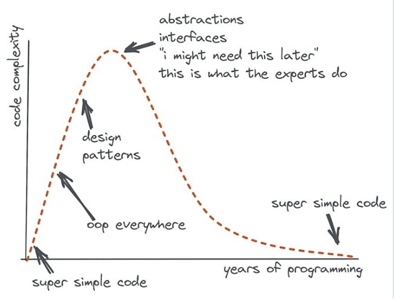

> NOTE: this readme like everything in here is W.I.P.

<h1>DBJ CORE</h1>

# Why?

I have many (many) years of software building in my past. and this is my current opinion on one diagram.




<br/>
To add to the above. I am pretty sure `DI` aka "Dependency Injection" is basically waste of time. Complex OOP with no obvious cause of existence. Especially for simple one man team projects. Oh and yes, `OOP` is waste of your time. In here there is no interfaces and no DI.

<br/>
Sometimes I am paid to use C#. Thus I have developed this little "dbj net core", from where I/we use configuration, logging and little utilities I have collected through the years. 

<br/>
How many years actually? I/we use `C#` commercially since 2001.

<br/>
Who is "we"? Basically, it is much simpler if I just skip that question.

## DBJ Core Usage

 **This is .NET assembly.** Do we need to say more? 2023Q4 it builds with .NET7. By no means, feel free to try .NET8

You already know how to add the project reference. Do you?

**And you are done**

> 
> Generally you are encouraged to browse through the code. 
> 
> Documentation is coming along. Slowly. But surely.
> 

# V Studio or VS Code?

I/we are sometimes [working with C# and like VS Code (a lot)?](https://code.visualstudio.com/docs/languages/csharp)
 
Please don't use VS Code only. Use Visual Studio. Allow me to repeat the official advice from the VS Code page:
 >
 > ***If you want the best possible experience for .NET / C# projects and development on Windows in general, we recommend you use Visual Studio Community.***
 >
 
 But, not all is lost (even for you the VS Code aficionado). `dotnet` cli command is your friend. We find it very easy to quickly setup the project using `dotnet`. 
 
 Our advice is:

 > VStudio for building and debugging. 'dotnet' cli for easy setup and VSCode for git.

 There are people who do not mix vscode and vstudio and use one or the other. We find both of them lacking some features. Found in the other one.

### What do I/we do?

We do not like multithreading, we like multiprocessing. Thus we do not use dbjcore in presence of multiple threads. 

And we usually use "fat containers" architecture. Containers with decoupled processes inside. Kind of a decoupled monoliths. Gasp! We like to make really independent micro services.

> In 2023, [DAPR](https://dapr.io/) , is one ready made example. fat-container (or multi process) with a lot of modules inside. hint: we think it is bad architecture (idea) otherwise.

Our code is small(ish) and it is distributed in remote modules/Linux services. Remote but local to one container. Thus `dbjcore` is all we need to be reused in them separate processes (aka Linux services).

All I said in here is not entirely true. We keep on adding stuff to our multi process containers. I am thinking of `kind-of-a` our own "side car" in one container. We certainly hope it will not grow to those proportions. And complexity.

#### Side advice (out of the blue)

We use, wherever we can this .NET optimization:
```c#
[MethodImpl(MethodImplOptions.AggressiveInlining)]
```
It is not a magic wand. Just a hint to a compiler. But very effective.

<hr/>